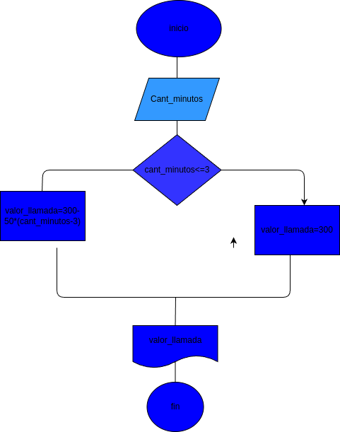

# Condicionales_1
condicionales_1
## Coste de una llamada telefonica

ingresar el tiempo de duracion de una llamada telefoni y determinar la cantidad a pagar,deacuerdo con lo siguiente:

- Toda llamada que dure 3 minutos o menos tiene un coste de 300 pesos.

- cada minuto adicional cuesta 50 pesos.

# analisis

## input

### variables de entrada

cant_minutos: la cantidad de minutos que duro la llamada

## processing

valor_llamada=300+50*(cant minutos -3)

## output

valor_llamada

# diseño

 "diagrama de flujo"

